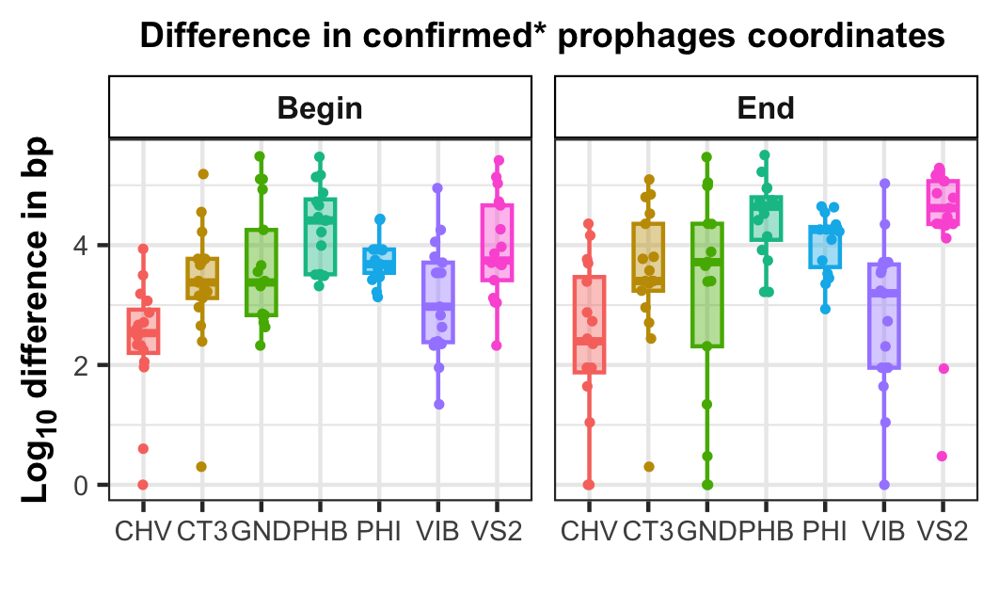
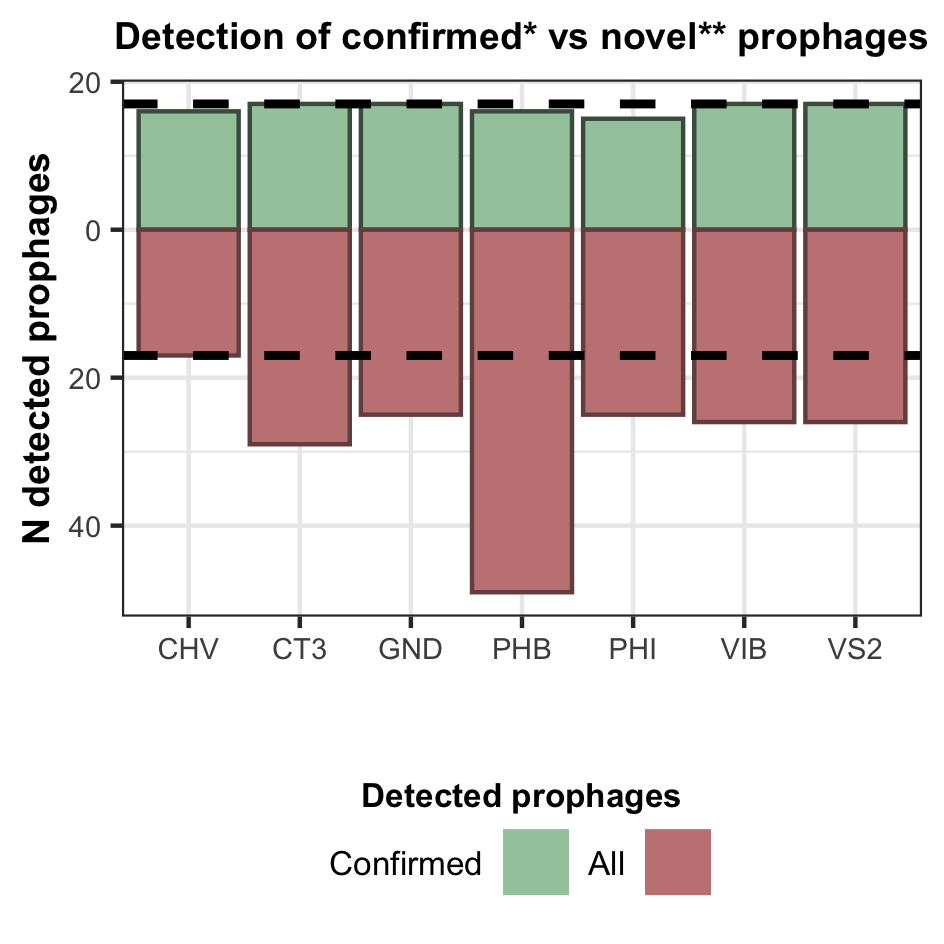
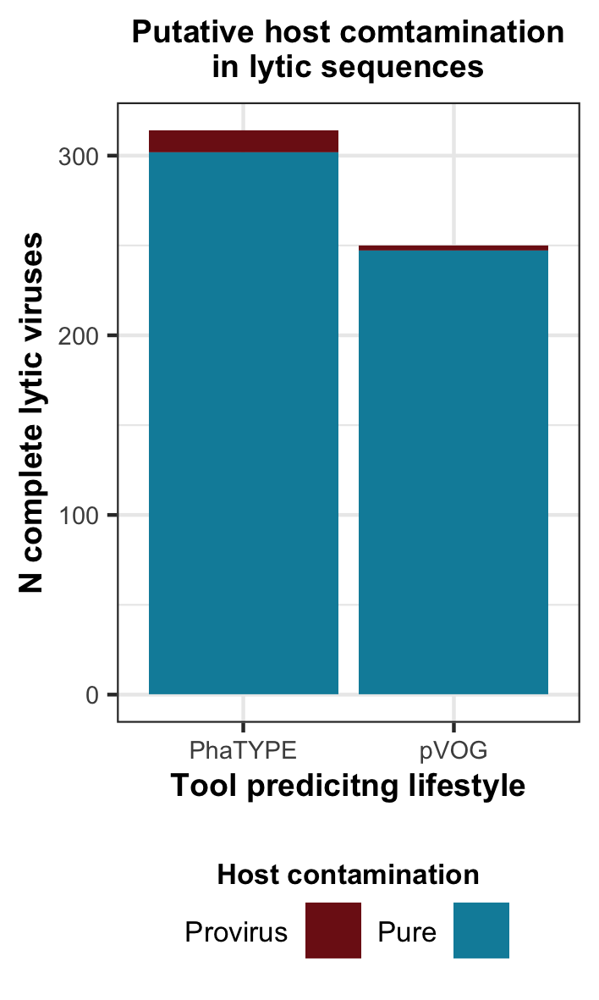

Here are scripts and results for the not-very-extensive benchmark of tools offering bacterial flanking regions around prophages from putative virus contigs.

**Motivation**: Even though metaviromes for the Chiliadal virome project were generated using the VLP-enrichment technique, it is difficult to guarantee that all the putative virus sequences identified by the tools in the Virome Discovery framework are free of bacterial genomic contamination. Since there is no gold standard method to trim such bacterial contamination, we have tested 7 existing tools that offer prophage pruning:

- [Cenote Taker3](https://github.com/mtisza1/Cenote-Taker3/releases/tag/v3.2.1)
- [CheckV](https://doi.org/10.1038/s41587-020-00774-7)
- [geNomad](https://doi.org/10.1038/s41587-023-01953-y)
- [PhageBoost](https://doi.org/10.1093/nargab/lqaa109)
- [Phigaro](https://doi.org/10.1093/bioinformatics/btaa250)
- [VIBRANT](https://doi.org/10.1186/s40168-020-00867-0)
- [VirSorter2](https://doi.org/10.1186/s40168-020-00990-y)

**The conclusion from the experiments:**

- CheckV showed the highest accuracy in the identification of prophage regions based on the coordinates for confirmed* prophages

- CheckV reported fewer false-positive prophage regions**, but did not detect one of the confirmed prophages
- CheckV did trim ~1.2 - 3.8% of the complete lytic*** phages, but did not trim any of complete crAssvirales genomes

   

*Confirmed prophages: prophages identified in the genome sequences of cultured bacteria and confirmed by either induction experiments or at least read alignment from multiple VLP samples (paper under preparation).  
**The identified prophage region was considered a false-positive if no VLP read alignment confirmation was derived for the specified region (might be a too stringent criterion). 
***Completeness of genomes was predicted by CheckV, and the lifestyle was predicted by PhaTYPE or the absence of phage integrase genes.
