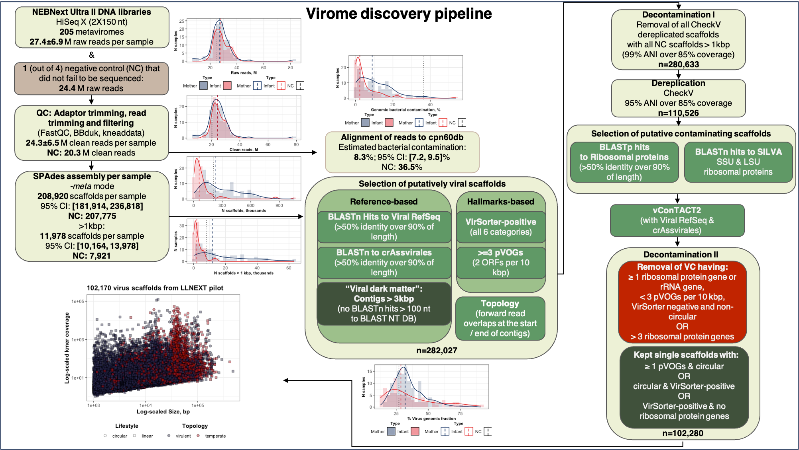

# Mother-Infant Gut Viruses and their Bacterial Hosts: Transmission Patterns and Dynamics during Pregnancy and Early Life

Code for our paper "Mother-Infant Gut Viruses and their Bacterial Hosts: Transmission Patterns and Dynamics during Pregnancy and Early Life".

You can download the current version of the paper from [BioRxiv](https://doi.org/10.1101/2023.08.21.554108).

## One-Sentence Summary
We studied the dynamics of the maternal virome during and after pregnancy, the infant virome during early life, with a particular focus on the transmission of viral strains from mothers to their infants. 

## Abstract
Early development of the gut ecosystem is crucial for lifelong health. While infant gut bacterial communities have been studied extensively, the infant gut virome remains under-explored. We longitudinally assessed the composition of gut viruses and their bacterial hosts in 322 total metagenomes and 205 metaviromes from 30 mothers during and after pregnancy and from their 32 infants during their first year of life. While the maternal gut virome composition remained stable during late pregnancy and after birth, the infant gut virome was dynamic in the first year of life and contained a higher abundance of active temperate phages compared to the maternal gut viromes. The infant gut virome composition was also influenced by infant feeding mode and place of delivery. Lastly, we provide evidence of viral-bacterial strains co-transmission from mothers to infants, demonstrating that infants acquire some of their virome from their mother’s gut.

## Data availability
Sample information, basic phenotypes, family structure and raw sequences are available in the [EGA archive](https://ega-archive.org/studies/EGAS00001005969). To access the data, please follow [these instructions](https://github.com/GRONINGEN-MICROBIOME-CENTRE/Lifelines_NEXT/blob/main/NEXT_pilot_microbial_transmission_mother_infant/Data_Access_EGA.md).
Virus scaffolds composing the virus data base generated from the samples can be found at [FigShare](https://doi.org/10.6084/m9.figshare.23926593)

## Code availability
[Virome discovery pipeline:](https://github.com/GRONINGEN-MICROBIOME-CENTRE/Lifelines_NEXT/tree/main/NEXT_pilot_microbial_transmission_mother_infant/Virome_discovery)
All scripts used to profile human gut virome and microbiome

[Building virus consensuses:](https://github.com/GRONINGEN-MICROBIOME-CENTRE/Lifelines_NEXT/tree/main/NEXT_pilot_microbial_transmission_mother_infant/Viral_alignments)
All scripts used to generate consensus sequences for vOTUs shared between mothers and their infants

[Downstream analysis:](https://github.com/GRONINGEN-MICROBIOME-CENTRE/Lifelines_NEXT/tree/main/NEXT_pilot_microbial_transmission_mother_infant/Downstream_analysis)
All scripts used for processing abundance tables and distance matrices, including plots

[Bacterial strains reconstruction:](https://github.com/GRONINGEN-MICROBIOME-CENTRE/Lifelines_NEXT/blob/main/NEXT_pilot_microbial_transmission_mother_infant/bacterial_strain_transmission_Strainphlan_4)
Code used to generate distance matrices for bacterial hosts of viruses of interest
